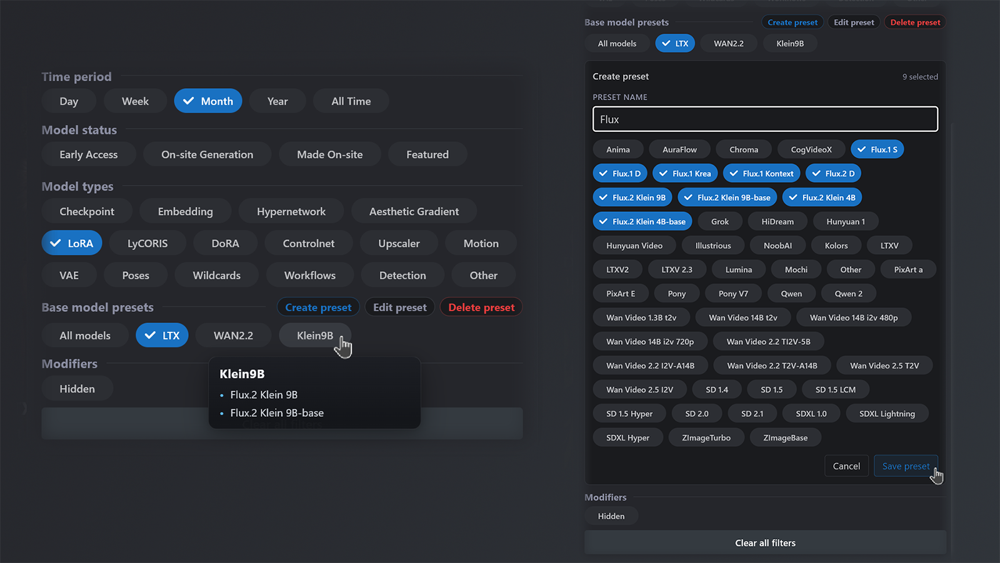

# Civitai Base Model Filter Scripts

Tampermonkey userscripts for replacing the `Base model` filter UI on `https://civitai.com/models`.

This repo currently includes two separate scripts:

- `civitai-base-model-chips.user.js`: restores the old chip-style model picker
- `civitai-base-model-presets.user.js`: replaces the model picker with preset chips backed by the live Civitai Base model list

## Chip Script Preview


## Preset Script Preview



## Chip Script

### What It Does

- Hides the original `Base model` MultiSelect from the page.
- Rebuilds the same filter as chip-style toggles that match the surrounding UI.
- Keeps the real hidden dropdown intact, so filtering still uses the site's own logic.
- Uses the live Civitai Base model list whenever it can read it.
- Falls back to `ALL_BASE_MODELS` only if the live list is temporarily unavailable.
- Adds a small `Copy model list` button in the `Base model` header to export the current Base model list as a ready-to-paste `const ALL_BASE_MODELS = [...]`.
- Warns you if the live list could not be read or if your hardcoded `ALL_BASE_MODELS` list is out of sync with the live Civitai list.

## Install

1. Install the Tampermonkey browser extension.
2. Open one of these files:
   - [`civitai-base-model-chips.user.js`](./civitai-base-model-chips.user.js)
   - [`civitai-base-model-presets.user.js`](./civitai-base-model-presets.user.js)
3. Create a new Tampermonkey script and paste the file contents.
4. Save it and visit `https://civitai.com/models`.

Only run one of the two scripts at a time.

## Chip Script Configuration

All configuration is hardcoded near the top of [`civitai-base-model-chips.user.js`](./civitai-base-model-chips.user.js).

### Filter Mode

```js
const MODE = FILTER_MODES.OFF;
```

Valid modes:

- `FILTER_MODES.OFF`
- `FILTER_MODES.BLACKLIST`
- `FILTER_MODES.WHITELIST`

### `ALL_BASE_MODELS`

This is a hardcoded fallback/reference list:

```js
const ALL_BASE_MODELS = [
  'Flux.2 Klein 9B',
  'Flux.2 Klein 9B-base',
  'Flux.2 Klein 4B',
];
```

The script always tries to use the live Civitai Base model list first. `ALL_BASE_MODELS` is only used when the live list cannot be read, and as a reference for sync warnings and your manual config values.

The `Copy model list` button copies the current Base model list in exactly this format. If the button turns yellow and shows a warning icon, one of two things is happening:

- the live Civitai list could not be read, so the chips are temporarily using `ALL_BASE_MODELS` as fallback
- `ALL_BASE_MODELS` no longer matches the live Civitai list, so you may want to update it to keep your fallback/reference list current

### Blacklist Mode Example

```js
const MODE = FILTER_MODES.BLACKLIST;

const BLACKLIST = [
  'Other',
  'PixArt E',
  'Anima',
];
```

Result: those models are visually removed from the custom chips only.

### Whitelist Mode Example

```js
const MODE = FILTER_MODES.WHITELIST;

const WHITELIST = [
  'Flux.2 Klein 9B',
  'Flux.2 Klein 9B-base',
  'Flux.2 Klein 4B',
  'Flux.2 Klein 4B-base',
];
```

Result: only those models are shown in the custom chips.

### Important Notes

- This feature is visual-only. The real dropdown still contains every site value.
- The script prefers the live Civitai Base model list whenever it can read it.
- The site backend is never told about the custom chip whitelist or blacklist.
- If the whitelist is empty, the script safely falls back to `off`.
- If the blacklist would remove everything, the script safely falls back to `off`.
- If a hidden model is already selected, the chip stays visible so you can still deselect it.
- Unknown names, duplicates, and spacing or case mismatches are ignored safely.

## Preset Script

[`civitai-base-model-presets.user.js`](./civitai-base-model-presets.user.js) is a separate userscript with a different workflow.

- Replaces the Base model picker with preset chips and a built-in `All models` chip.
- Stores presets in browser `localStorage`, so they persist across reloads.
- Uses the live Civitai Base model list for preset creation, editing, and application.
- Lets you create, edit, rename, and delete presets inline in the `Base model` section.
- Temporarily disables preset actions and shows a warning if the live Base model list cannot be read.
- Ignores removed models when applying an older preset and warns about them in edit mode.

## Files

- [`civitai-base-model-chips.user.js`](./civitai-base-model-chips.user.js): the userscript
- [`civitai-base-model-presets.user.js`](./civitai-base-model-presets.user.js): the preset-based userscript
- [`compare.png`](./compare.png): chip script preview image
- [`presets.png`](./presets.png): preset script preview image
- [`LICENSE`](./LICENSE): MIT license

## License

MIT. See [`LICENSE`](./LICENSE).
