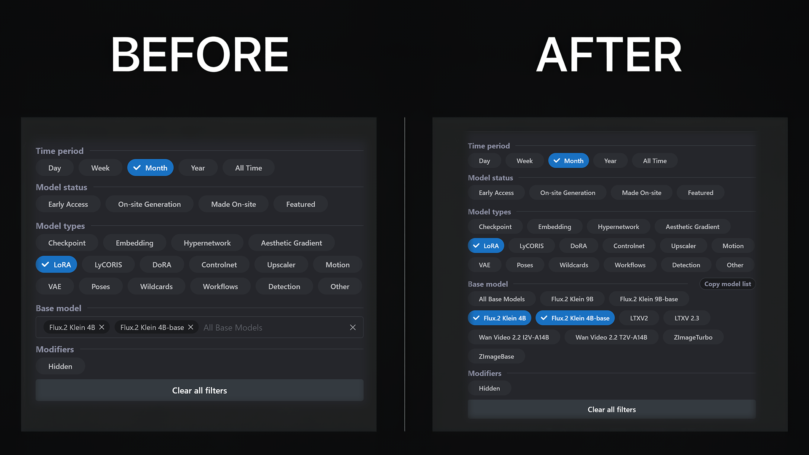

# Civitai Base Model Chips



Tampermonkey userscript that restores the `Base model` filter on `https://civitai.com/models` to a chip-style picker instead of the newer dropdown-only UI.

## What It Does

- Hides the original `Base model` MultiSelect from the page.
- Rebuilds the same filter as chip-style toggles that match the surrounding UI.
- Keeps the real hidden dropdown intact, so filtering still uses the site's own logic.
- Adds a small `Copy model list` button in the `Base model` header to export the current live dropdown values as a ready-to-paste `const ALL_BASE_MODELS = [...]`.
- Warns you when Civitai adds new base models that are missing from your hardcoded `ALL_BASE_MODELS` list.

## Install

1. Install the Tampermonkey browser extension.
2. Open [`civitai-base-model-chips.user.js`](./civitai-base-model-chips.user.js).
3. Create a new Tampermonkey script and paste the file contents.
4. Save it and visit `https://civitai.com/models`.

## Configuration

All configuration is hardcoded near the top of [`civitai-base-model-chips.user.js`](./civitai-base-model-chips.user.js).

### Filter Mode

```js
const MODE = FILTER_MODES.OFF;
```

Valid modes:

- `FILTER_MODES.OFF`
- `FILTER_MODES.BLACKLIST`
- `FILTER_MODES.WHITELIST`

### `ALL_BASE_MODELS`

This is the hardcoded reference list used for matching your manual config values:

```js
const ALL_BASE_MODELS = [
  'Flux.2 Klein 9B',
  'Flux.2 Klein 9B-base',
  'Flux.2 Klein 4B',
];
```

When Civitai adds new base models, use the `Copy model list` button in the UI. It copies the current live dropdown values in exactly this format. Replace the constant in the script with the copied block.

If the button turns yellow and shows a warning icon, the live Civitai dropdown contains one or more base models that are not in `ALL_BASE_MODELS` yet. Hover the button to see the native tooltip with the missing model names, then click it and replace the hardcoded list manually.

### Blacklist Mode Example

```js
const MODE = FILTER_MODES.BLACKLIST;

const BLACKLIST = [
  'Other',
  'PixArt E',
  'Anima',
];
```

Result: those models are visually removed from the custom chips only.

### Whitelist Mode Example

```js
const MODE = FILTER_MODES.WHITELIST;

const WHITELIST = [
  'Flux.2 Klein 9B',
  'Flux.2 Klein 9B-base',
  'Flux.2 Klein 4B',
  'Flux.2 Klein 4B-base',
];
```

Result: only those models are shown in the custom chips.

### Important Notes

- This feature is visual-only. The real dropdown still contains every site value.
- The site backend is never told about the custom chip whitelist or blacklist.
- If the whitelist is empty, the script safely falls back to `off`.
- If the blacklist would remove everything, the script safely falls back to `off`.
- If a hidden model is already selected, the chip stays visible so you can still deselect it.
- Unknown names, duplicates, and spacing or case mismatches are ignored safely.

## Files

- [`civitai-base-model-chips.user.js`](./civitai-base-model-chips.user.js): the userscript
- [`compare.png`](./compare.png): before/after preview image
- [`LICENSE`](./LICENSE): MIT license

## License

MIT. See [`LICENSE`](./LICENSE).
